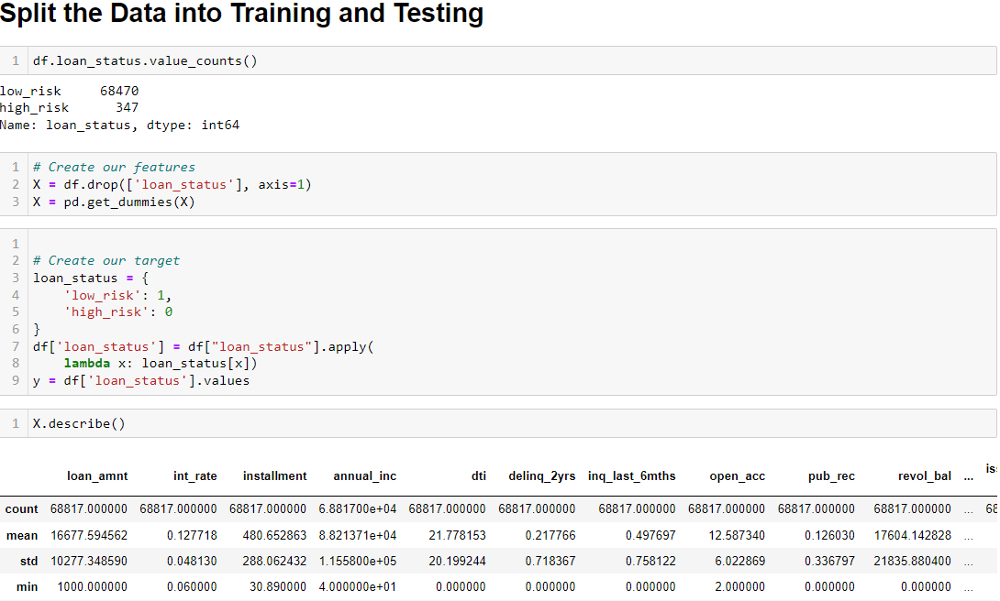

# Credit_Risk_Analysis
Evaluating the performances of different models to predict credit risk.

## Overview of Analysis

The purpose of this analysis is to evaluate the performance of resampling algorithms, RandomOverSampler, SMOTE, ClusterCentroids and SMOTEENN; and evaluate the performance of two ensemble classifiers, BalancedRandomForestClassifier and EasyEnsembleClassifier, on an imbalanced dataset from LendingTree. Then, calculate then generate the accuracy score, confusion matrix and classification report to make a recommendation on whether they should be used to predict credit risk.

## Results

## Summary
