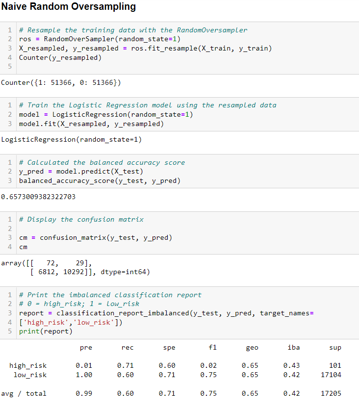
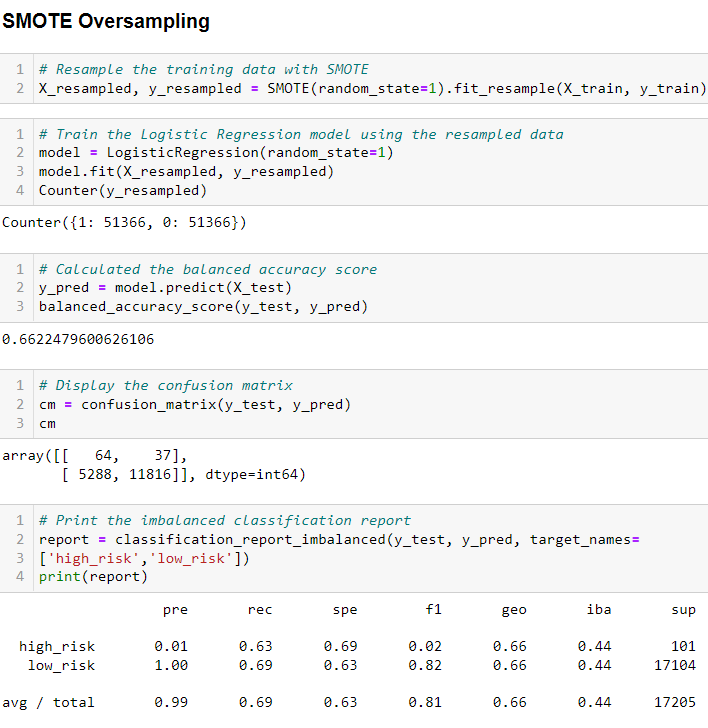
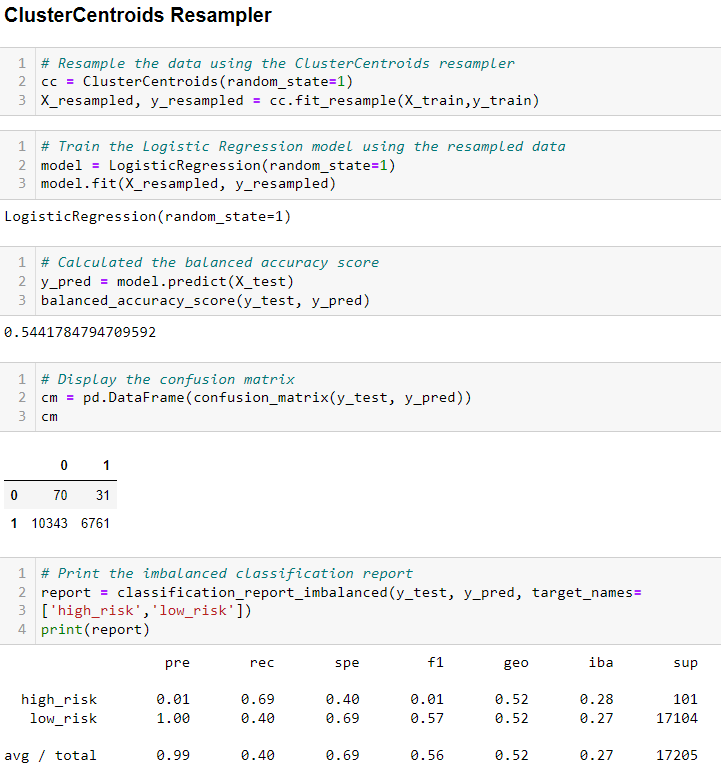
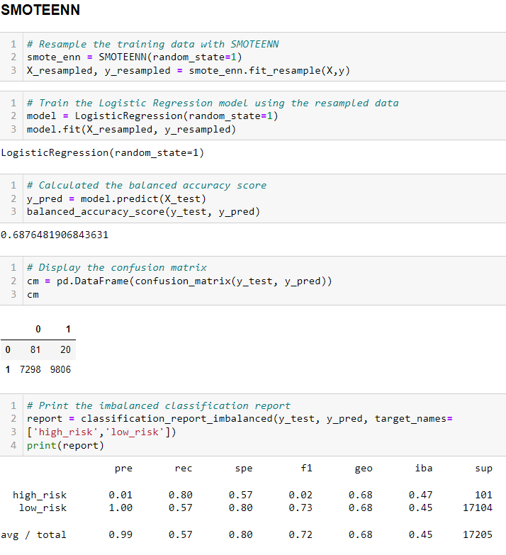
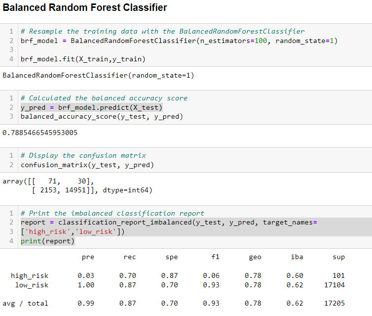
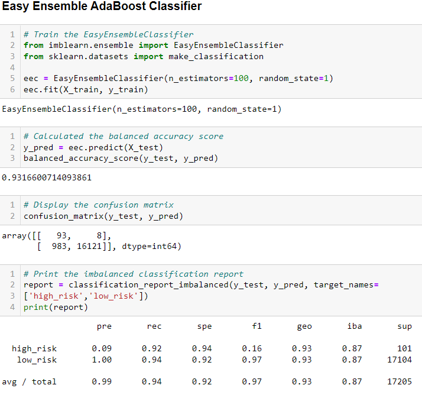

# Credit_Risk_Analysis
Evaluating the performances of different models to predict credit risk.

## Overview
The purpose of this analysis is to evaluate the performance of resampling algorithms, RandomOverSampler, SMOTE, ClusterCentroids and SMOTEENN; and evaluate the performance of two ensemble classifiers, BalancedRandomForestClassifier and EasyEnsembleClassifier, on an imbalanced dataset from LendingTree. The accuracy score, confusion matrix, and classification report are used to access each model and determine whether they should be used to predict credit risk.

## Tools
- Jupyter Notebook
- Python (scikit-learn and imbalanced-learn libraries)

## Results
For each resampling algorithm, LogisticRegression classifier from scikit-learn is used to evaluate their performances. All images below contain the balanced accuracy score, confusion matrix, and the classification report for each result. '0' represents 'high_risk' rand 1 represents 'low_risk'.

- RandomOversampler (Naive Random Oversampling)

    Results go here
  

- SMOTE Oversampling

    Results go here
  

- ClusterCentroids Resampler (Undersampling)

    results go here
      

- SMOTEENN (Combination Sampling)

    Results go here
      

Ensemble algorithms results are listed below. Both models were trained using the original training sets. 

- BalancedRandomForestClassifier
    
    Results go here
      

- EasyEnsembleClassifier (Easy Ensemble AdaBoost Classifier)

    results go here
      

## Summary
